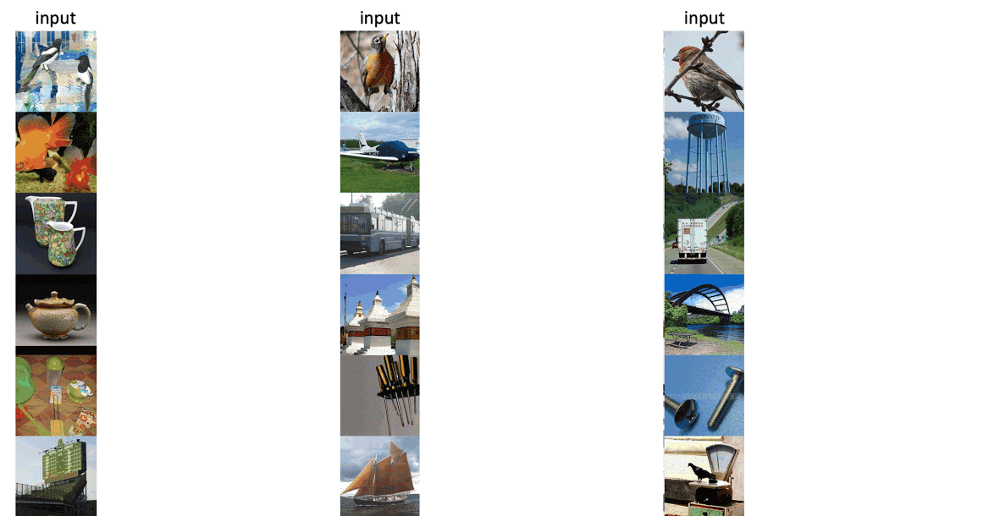
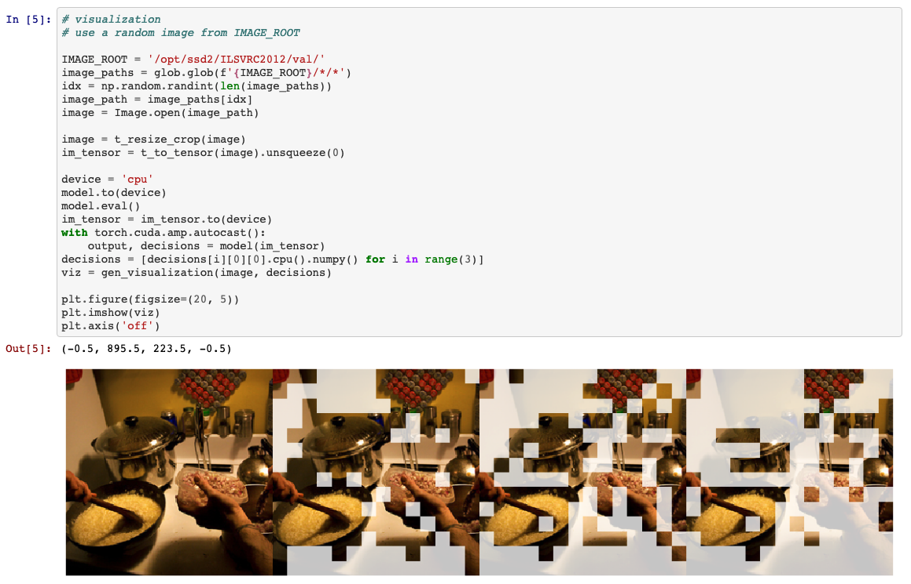

# Efficient Vision Transformers and CNNs with Dynamic Spatial Sparsification

This repository contains PyTorch implementation for DynamicViT (NeurIPS 2021).

**DynamicViT** is a dynamic token sparsification framework to prune redundant tokens in vision transformers progressively and dynamically based on the input. Our method can reduces over **30%** FLOPs and improves the throughput by over **40%** while the drop of accuracy is within **0.5%** for various vision transformers.

[[Project Page]](https://dynamicvit.ivg-research.xyz/) [[arXiv (NeurIPS 2021)]](https://arxiv.org/abs/2106.02034)

### 🔥Updates

We extend our method to more **network architectures** (i.e., ConvNeXt and Swin Transformers) and more **tasks** (i.e., object detection and semantic segmentation) with an improved ***dynamic spatial sparsification*** framework. Please refer to the extended version of our paper for details. The extended version has been accepted by T-PAMI. 

[[arXiv (T-PAMI, Journal Version)]](https://arxiv.org/abs/2207.01580)

### Image Examples



---

### Video Examples


## Model Zoo

We provide our DynamicViT models pretrained on ImageNet:
| name | model | rho | acc@1 | acc@5 | FLOPs | url |
| --- | --- | --- | --- | --- | --- | --- |
| DynamicViT-DeiT-256/0.7 | ```deit-256``` | 0.7 | 76.53 | 93.12 | 1.3G | [Google Drive](https://drive.google.com/file/d/1fpdTNRZtGOW25UwOadj1iUdjqmu88WkO/view?usp=sharing) / [Tsinghua Cloud](https://cloud.tsinghua.edu.cn/f/b0e1ff6af1004039855e/?dl=1) |
| DynamicViT-DeiT-S/0.7 | ```deit-s``` | 0.7 | 79.32 | 94.68 | 2.9G | [Google Drive](https://drive.google.com/file/d/1H5kHHagdqo4emk9CgjfA7DA62XJr8Yc1/view?usp=sharing) / [Tsinghua Cloud](https://cloud.tsinghua.edu.cn/f/698896dfbcea430b9591/?dl=1)|
| DynamicViT-DeiT-B/0.7 | ```deit-b``` | 0.7 | 81.43 | 95.46 | 11.4G | [Google Drive](https://drive.google.com/file/d/1J9PCPiOSHmzRiWw370GDYJPEZ8r4uU3M/view?usp=sharing) / [Tsinghua Cloud](https://cloud.tsinghua.edu.cn/f/660f27ddb6b945a797a8/?dl=1)|
| DynamicViT-LVViT-S/0.5 | ```lvvit-s``` | 0.5 | 81.97 | 95.76 | 3.7G | [Google Drive](https://drive.google.com/file/d/1kPe3MhtYHNdG7natrU20xcAqodO6-Z58/view?usp=sharing) / [Tsinghua Cloud](https://cloud.tsinghua.edu.cn/f/635cb172312749e39cf2/?dl=1) |
| DynamicViT-LVViT-S/0.7 | ```lvvit-s``` | 0.7 | 83.08 | 96.25 | 4.6G | [Google Drive](https://drive.google.com/file/d/1dNloEsuEiTi592SdM_ELC36kOJ7aaF-3/view?usp=sharing) / [Tsinghua Cloud](https://cloud.tsinghua.edu.cn/f/d732a3511dd64db598e1/?dl=1)|
| DynamicViT-LVViT-M/0.7 | ```lvvit-m``` | 0.7 | 83.82 | 96.58 | 8.5G | [Google Drive](https://drive.google.com/file/d/1dNab1B5ZOTVNpnpO6H1TsXKFM8BAlA3I/view?usp=sharing) / [Tsinghua Cloud](https://cloud.tsinghua.edu.cn/f/b8d1efdfc41d4777903e/?dl=1) |

---

**🔥Updates:** We provide our DynamicCNN and DynamicSwin models pretrained on ImageNet:

| name              | model            | rho  | acc@1 | acc@5 | FLOPs | url                                                          |
| ----------------- | ---------------- | ---- | ----- | ----- | ----- | ------------------------------------------------------------ |
| DynamicCNN-T/0.7  | ```convnext-t``` | 0.7  | 81.59 | 95.72 | 3.6G  | [Google Drive](https://drive.google.com/file/d/1Jdp5Xi5E3teBm6zfXqAE681XiszrwqCe/view?usp=sharing) / [Tsinghua Cloud](https://cloud.tsinghua.edu.cn/f/95b2daf7593a42f48baa/?dl=1) |
| DynamicCNN-T/0.9  | ```convnext-t``` | 0.9  | 82.06 | 95.89 | 3.9G  | [Google Drive](https://drive.google.com/file/d/1AHh4kQ_zecKhDzm4bvcZxdl0SoJA3K4Q/view?usp=sharing) / [Tsinghua Cloud](https://cloud.tsinghua.edu.cn/f/030c6b8268104c16a666/?dl=1) |
| DynamicCNN-S/0.7  | ```convnext-s``` | 0.7  | 82.57 | 96.29 | 5.8G  | [Google Drive](https://drive.google.com/file/d/155I0ixZzLFLn9xqZtQML5lXt0QWiQaak/view?usp=sharing) / [Tsinghua Cloud](https://cloud.tsinghua.edu.cn/f/293972cc7d8c4adaac23/?dl=1) |
| DynamicCNN-S/0.9  | ```convnext-s``` | 0.9  | 83.12 | 96.42 | 6.8G  | [Google Drive](https://drive.google.com/file/d/1xFvhSXua2w2m1tr3WFA_d8MH3wEGgRhN/view?usp=sharing) / [Tsinghua Cloud](https://cloud.tsinghua.edu.cn/f/64c4ed5ab02d45998bf6/?dl=1) |
| DynamicCNN-B/0.7  | ```convnext-b``` | 0.7  | 83.45 | 96.56 | 10.2G | [Google Drive](https://drive.google.com/file/d/1epwmGKOEfqjU-WITgrB9VXTWhCu6pcgG/view?usp=sharing) / [Tsinghua Cloud](https://cloud.tsinghua.edu.cn/f/1e3a861f272142c38bbc/?dl=1) |
| DynamicCNN-B/0.9  | ```convnext-b``` | 0.9  | 83.96 | 96.76 | 11.9G | [Google Drive](https://drive.google.com/file/d/1lQLXnxETK6hpsx2Tcv3q1HtRjLI21epl/view?usp=sharing) / [Tsinghua Cloud](https://cloud.tsinghua.edu.cn/f/9b4c8df7b30d410bba75/?dl=1) |
| DynamicSwin-T/0.7 | ```swin-t```     | 0.7  | 80.91 | 95.42 | 4.0G  | [Google Drive](https://drive.google.com/file/d/1BFlCvXedgttyj8n9smcNphE7NLOy99ig/view?usp=sharing) / [Tsinghua Cloud](https://cloud.tsinghua.edu.cn/f/6a3d0de592f04d77a2fa/?dl=1) |
| DynamicSwin-S/0.7 | ```swin-s```     | 0.7  | 83.21 | 96.33 | 6.9G  | [Google Drive](https://drive.google.com/file/d/1gveNkt5aCzjb5CX_DaGq_XJRvvxruxmy/view?usp=sharing) / [Tsinghua Cloud](https://cloud.tsinghua.edu.cn/f/86b58132f354495590d0/?dl=1) |
| DynamicSwin-B/0.7 | ```swin-b```     | 0.7  | 83.43 | 96.45 | 12.1G | [Google Drive](https://drive.google.com/file/d/1sJctKZxdIH0zHwTekWmmCns_1AOeFzeN/view?usp=sharing) / [Tsinghua Cloud](https://cloud.tsinghua.edu.cn/f/ea260248adc040929970/?dl=1) |

## Usage

### Requirements

- torch>=1.8.0
- torchvision>=0.9.0
- timm==0.3.2
- tensorboardX
- six
- fvcore

**Data preparation**: download and extract ImageNet images from http://image-net.org/. The directory structure should be

```
│ILSVRC2012/
├──train/
│  ├── n01440764
│  │   ├── n01440764_10026.JPEG
│  │   ├── n01440764_10027.JPEG
│  │   ├── ......
│  ├── ......
├──val/
│  ├── n01440764
│  │   ├── ILSVRC2012_val_00000293.JPEG
│  │   ├── ILSVRC2012_val_00002138.JPEG
│  │   ├── ......
│  ├── ......
```

**Model preparation**: download pre-trained models if necessary:

| model | url | model | url |
| --- | --- | --- | --- |
| DeiT-Small | [link](https://dl.fbaipublicfiles.com/deit/deit_small_patch16_224-cd65a155.pth) | LVViT-S | [link](https://github.com/zihangJiang/TokenLabeling/releases/download/1.0/lvvit_s-26M-224-83.3.pth.tar) |
| DeiT-Base | [link](https://dl.fbaipublicfiles.com/deit/deit_base_patch16_224-b5f2ef4d.pth) | LVViT-M | [link](https://github.com/zihangJiang/TokenLabeling/releases/download/1.0/lvvit_m-56M-224-84.0.pth.tar) |
| ConvNeXt-T | [link](https://dl.fbaipublicfiles.com/convnext/convnext_tiny_1k_224_ema.pth) | Swin-T | [link](https://github.com/SwinTransformer/storage/releases/download/v1.0.0/swin_tiny_patch4_window7_224.pth) |
| ConvNeXt-S | [link](https://dl.fbaipublicfiles.com/convnext/convnext_small_1k_224_ema.pth) | Swin-S | [link](https://github.com/SwinTransformer/storage/releases/download/v1.0.0/swin_small_patch4_window7_224.pth) |
| ConvNeXt-B | [link](https://dl.fbaipublicfiles.com/convnext/convnext_base_1k_224_ema.pth) | Swin-B | [link](https://github.com/SwinTransformer/storage/releases/download/v1.0.0/swin_base_patch4_window7_224.pth) |


### Demo

You can try DynamicViT on Colab [![][colab]][colab-dynamicvit]. Thank [@dirtycomputer](https://github.com/dirtycomputer) for the contribution.  

[colab]: <https://colab.research.google.com/assets/colab-badge.svg>
[colab-dynamicvit]: <https://colab.research.google.com/github/raoyongming/DynamicViT/blob/master/colab_demo.ipynb>


We also provide a [Jupyter notebook](https://github.com/raoyongming/DynamicViT/blob/master/viz_example.ipynb) where you can run the visualization of DynamicViT.

To run the demo, you need to install ```matplotlib```.



### Evaluation

To evaluate a pre-trained DynamicViT model on the ImageNet validation set with a single GPU, run:

```
python infer.py --data_path /path/to/ILSVRC2012/ --model model_name \
--model_path /path/to/model --base_rate 0.7 
```


### Training

To train Dynamic Spatial Sparsification models on ImageNet, run:

(You can train models with different keeping ratio by adjusting ```base_rate```. )

**DeiT-S**

```
python -m torch.distributed.launch --nproc_per_node=8 --use_env main.py --output_dir logs/dynamicvit_deit-s --model deit-s --input_size 224 --batch_size 128 --data_path /path/to/ILSVRC2012/ --epochs 30 --base_rate 0.7 --lr 1e-3 --warmup_epochs 5
```

**DeiT-B**

```
python -m torch.distributed.launch --nproc_per_node=8 --use_env main.py --output_dir logs/dynamicvit_deit-b --model deit-b --input_size 224 --batch_size 128 --data_path /path/to/ILSVRC2012/ --epochs 30 --base_rate 0.7 --lr 1e-3 --warmup_epochs 5 --drop_path 0.2 --ratio_weight 5.0
```

**LV-ViT-S**

```
python -m torch.distributed.launch --nproc_per_node=8 --use_env main.py --output_dir logs/dynamicvit_lvvit-s --model lvvit-s --input_size 224 --batch_size 128 --data_path /path/to/ILSVRC2012/ --epochs 30 --base_rate 0.7 --lr 1e-3 --warmup_epochs 5
```

**LV-ViT-M**

```
python -m torch.distributed.launch --nproc_per_node=8 --use_env main.py --output_dir logs/dynamicvit_lvvit-m --model lvvit-m --input_size 224 --batch_size 128 --data_path /path/to/ILSVRC2012/ --epochs 30 --base_rate 0.7 --lr 1e-3 --warmup_epochs 5
```

DynamicViT can also achieve comparable performance with only 15 epochs training (around 0.1% lower accuracy compared to 30 epochs).

**ConvNeXt-T**

Train on 8 GPUs: 

```
python -m torch.distributed.launch --nproc_per_node=8 --use_env main.py --output_dir logs/dynamic_conv-t --model convnext-t --input_size 224 --batch_size 128 --data_path /path/to/ILSVRC2012/ --epochs 120 --base_rate 0.7 --lr 4e-3 --drop_path 0.2 --update_freq 4 --lr_scale 0.2
```

Train on 4 8-GPU nodes:

```
python run_with_submitit.py --nodes 4 --ngpus 8 --output_dir logs/dynamic_conv-t --model convnext-t --input_size 224 --batch_size 128 --data_path /path/to/ILSVRC2012/ --epochs 120 --base_rate 0.7 --lr 4e-3 --drop_path 0.2 --update_freq 1 --lr_scale 0.2
```

**ConvNeXt-S**

Train on 8 GPUs: 

```
python -m torch.distributed.launch --nproc_per_node=8 --use_env main.py --output_dir logs/dynamic_conv-s --model convnext-s --input_size 224 --batch_size 128 --data_path /path/to/ILSVRC2012/ --epochs 120 --base_rate 0.7 --lr 4e-3 --drop_path 0.2 --update_freq 4 --lr_scale 0.2
```

Train on 4 8-GPU nodes:

```
python run_with_submitit.py --nodes 4 --ngpus 8 --output_dir logs/dynamic_conv-s --model convnext-s --input_size 224 --batch_size 128 --data_path /path/to/ILSVRC2012/ --epochs 120 --base_rate 0.7 --lr 4e-3 --drop_path 0.2 --update_freq 1 --lr_scale 0.2
```

**ConvNeXt-B**

Train on 8 GPUs: 

```
python -m torch.distributed.launch --nproc_per_node=8 --use_env main.py --output_dir logs/dynamic_conv-b --model convnext-b --input_size 224 --batch_size 128 --data_path /path/to/ILSVRC2012/ --epochs 120 --base_rate 0.7 --lr 4e-3 --drop_path 0.5 --update_freq 4 --lr_scale 0.2
```

Train on 4 8-GPU nodes:

```
python run_with_submitit.py --nodes 4 --ngpus 8 --output_dir logs/dynamic_conv-b --model convnext-b --input_size 224 --batch_size 128 --data_path /path/to/ILSVRC2012/ --epochs 120 --base_rate 0.7 --lr 4e-3 --drop_path 0.5 --update_freq 1 --lr_scale 0.2
```

**Swin-T**

Train on 8 GPUs:

```
python -m torch.distributed.launch --nproc_per_node=8 --use_env main.py --output_dir logs/dynamic_swin-t --model swin-t --input_size 224 --batch_size 128 --data_path /path/to/ILSVRC2012/ --epochs 120 --base_rate 0.7 --lr 4e-3 --drop_path 0.2 --update_freq 4 --lr_scale 0.2
```

Train on 4 8-GPU nodes:

```
python run_with_submitit.py --nodes 4 --ngpus 8 --output_dir logs/dynamic_swin-t --model swin-t --input_size 224 --batch_size 128 --data_path /path/to/ILSVRC2012/ --epochs 120 --base_rate 0.7 --lr 4e-3 --drop_path 0.2 --update_freq 1 --lr_scale 0.2
```

**Swin-S**

Train on 8 GPUs: 

```
python -m torch.distributed.launch --nproc_per_node=8 --use_env main.py --output_dir logs/dynamic_swin-s --model swin-s --input_size 224 --batch_size 128 --data_path /path/to/ILSVRC2012/ --epochs 120 --base_rate 0.7 --lr 4e-3 --drop_path 0.2 --update_freq 4 --lr_scale 0.2
```

Train on 4 8-GPU nodes:

```
python run_with_submitit.py --nodes 4 --ngpus 8 --output_dir logs/dynamic_swin-s --model swin-s --input_size 224 --batch_size 128 --data_path /path/to/ILSVRC2012/ --epochs 120 --base_rate 0.7 --lr 4e-3 --drop_path 0.2 --update_freq 1 --lr_scale 0.2
```

**Swin-B**

Train on 8 GPUs: 

```
python -m torch.distributed.launch --nproc_per_node=8 --use_env main.py --output_dir logs/dynamic_swin-b --model swin-b --input_size 224 --batch_size 128 --data_path /path/to/ILSVRC2012/ --epochs 120 --base_rate 0.7 --lr 4e-3 --drop_path 0.5 --update_freq 4 --lr_scale 0.2
```

Train on 4 8-GPU nodes:

```
python run_with_submitit.py --nodes 4 --ngpus 8 --output_dir logs/dynamic_swin-b --model swin-b --input_size 224 --batch_size 128 --data_path /path/to/ILSVRC2012/ --epochs 120 --base_rate 0.7 --lr 4e-3 --drop_path 0.5 --update_freq 1 --lr_scale 0.2
```

## License

MIT License

## Acknowledgements

Our code is based on [pytorch-image-models](https://github.com/rwightman/pytorch-image-models), [DeiT](https://github.com/facebookresearch/deit), [LV-ViT](https://github.com/zihangJiang/TokenLabeling), [ConvNeXt](https://github.com/facebookresearch/ConvNeXt) and [Swin-Transformer](https://github.com/microsoft/Swin-Transformer).

## Citation
If you find our work useful in your research, please consider citing:
```
@inproceedings{rao2021dynamicvit,
  title={DynamicViT: Efficient Vision Transformers with Dynamic Token Sparsification},
  author={Rao, Yongming and Zhao, Wenliang and Liu, Benlin and Lu, Jiwen and Zhou, Jie and Hsieh, Cho-Jui},
  booktitle = {Advances in Neural Information Processing Systems (NeurIPS)},
  year = {2021}
}
```

```
@article{rao2022dynamicvit,
  title={Dynamic Spatial Sparsification for Efficient Vision Transformers and Convolutional Neural Networks},
  author={Rao, Yongming and Liu, Zuyan and Zhao, Wenliang and Zhou, Jie and Lu, Jiwen},
  journal={arXiv preprint arXiv:2207.01580},
  year={2022}
```
